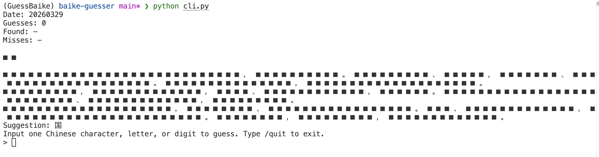

# Baike Guesser



## Question Definition

[Guess Baike (猜百科)](https://xiaoce.fun/baike) is a Chinese-language-based puzzle that requires the user to guess the title of a Baike (Chinese Wikipedia) entry.

This solver tries to optimize the guess procedure with the use of Chinese character distribution. To maximize the similarity of the guessing procedures of the algorithm and the human, assumptions are made about the resources achievable by the algorithm.

Assumptions:
1. The algorithm can access the natural Chinese language character distribution (mocked with 2012 Google Ngram), from 1-gram up to 6-gram.
2. The algorithm can know the general domains covered by the Baike, e.g., technology, news, history, etc..
3. The algorithm does not have access to any specific list of keywords under each domain.
4. The algorithm does not know the selection rule of the daily keyword by the Guess Baike website.


##  Solving strategy(ies)

1. Maximized character-probability
   The posterior probability is calculated with both the known guesses in the title and the text body. On each state with the known title context $C_t$ and body character set $S_b$, for each unguessed character $w$ in the vocabulary, we can obtain a position-sensitive probability $P_s(w|C_t)$ indicating the averaged probabilty of having $w$ in any position of the title with knowing the position and chars $C_t$, and a position-insensitive probability $P_i(w|S_b)$ indicating the probability of having $w$ with knowing the chars $S_b$ in body text.

   The two posterior distribution are weighted averaged by $\alpha P_s(w|C_t) + \beta P_i(w|S_b)$, where $\alpha$ and $\beta$ are two configurable weights. Default $\alpha = 0.8$ and $\beta = 0.2$.

   The suggestion is given by the top-1-probability character.

2. [TODO] Maximize domain possibility: try to hit the domain first -> then max prob.
3. [TODO] Concreteness info: raise weight for concrete words.
4. [TODO] When len(title) > 6, dynamically chunck sub-ngrams.
5. [TODO] To support when title contains numbers or alphabets.
6. [TODO] Use n-gram info from the text body (chunking with punctuation + stopwords).


## Interaction

Interaction with Guess Baike website: This program mocks the request to the website, takes the user input, and update to the website.

Before using the suggestion, the ngram frequency data should be downloaded, or build other ngrams through the instruction in this HuggingFace repo.

```bash
git clone https://huggingface.co/datasets/ruoxining/google-ngram-zh-2012
```

Run this command to start interaction.

```bash
python cli.py
```
