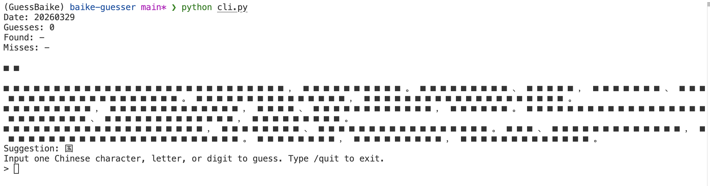

# Baike Guesser



## What is this

[Guess Baike (猜百科)](https://xiaoce.fun/baike) is a Chinese-language puzzle where you guess the title of a Baike (Chinese Wikipedia) entry.

This solver uses Chinese character distribution to optimise guessing, based on what a fluent reader would know — the Google Ngram corpus — with no access to any Baike article database.

Assumptions:
1. The algorithm can access the natural Chinese character distribution (Google Ngram 2012, 1–6 gram).
2. The algorithm can infer general article domains (technology, history, geography, …) from the corpus tags.
3. The algorithm does not have access to any keyword list under any domain.
4. The algorithm does not know the daily puzzle selection rule.

## Setup

**1. Download raw ngram shards** (~2 GB compressed for 1–2 gram):

```bash
bash scripts/download_ngram.sh          # 1–2 gram (default)
bash scripts/download_ngram.sh 3        # also fetch 3-gram (~17 GB extra)
```

**2. Build corpus JSON files** from the downloaded shards:

```bash
bash scripts/build_ngram.sh
```

**3. Tag ngrams** with domain and entity labels:

```bash
bash scripts/tag_ngrams.sh
```

**4. Merge corpora** (combines 2012 and 2020 data into `data/google-ngram-zh/`):

```bash
bash scripts/merge_ngram.sh
```

## Usage

**Play today's puzzle** — fetches, saves, then launches the interactive solver:

```bash
bash scripts/play_today.sh
bash scripts/play_today.sh --date 20260604
bash scripts/play_today.sh --sub-type history
bash scripts/play_today.sh --algo combined
```

**Record today's puzzle** — saves to `puzzles/<date>.json` for later benchmarking:

```bash
bash scripts/record_today.sh
bash scripts/record_today.sh --date 20260604
bash scripts/record_today.sh --sub-type history
```

**Run benchmark** across all puzzles in `puzzles/`:

```bash
bash scripts/benchmark.sh
bash scripts/benchmark.sh --algos constraint entropy combined
bash scripts/benchmark.sh --puzzle puzzles/20260615.json
bash scripts/benchmark.sh --max-guesses 60 --no-save
```

## Algorithms

Six solver algorithms are implemented under `algo/`. See [doc/ALGORITHMS.md](doc/ALGORITHMS.md) for strategy details, complexity analysis, and trade-off comparisons.

## Future Optimization

Even the combined algorithm (F) struggles. Two directions for optimization:

**Corpus staleness.** The Google Ngram dataset is anchored to 2012 (with a partial 2020 supplement). Baike entries for recent events, internet slang, emerging technology terms, and contemporary cultural figures accumulate frequencies that simply do not exist in this corpus. The solver has no signal to work from when the puzzle target is a concept born after the data cut-off, so it falls back on generic character distributions that do little to narrow the candidate space.

**Polysemy in domain classification.** The domain tagger assigns each character or n-gram to its statistically dominant sense, but many common characters carry meanings across wildly different fields. A character that overwhelmingly appears in geography contexts in the corpus may be the key component of a technology term in the puzzle answer. When the solver infers domain from these tags, it can commit to the wrong field early and systematically deprioritise the right answer. Addressing this would likely require either a context-sensitive sense disambiguator or a softer domain prior that keeps multiple hypotheses alive longer.
